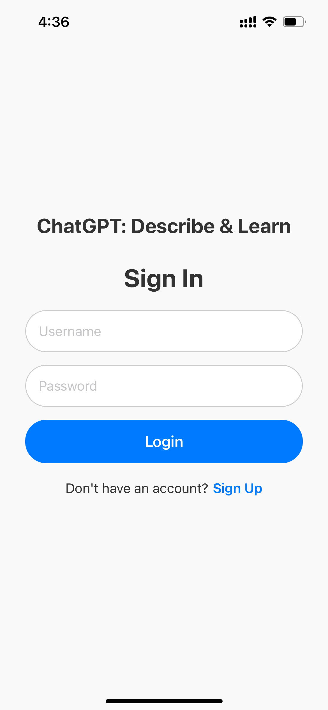
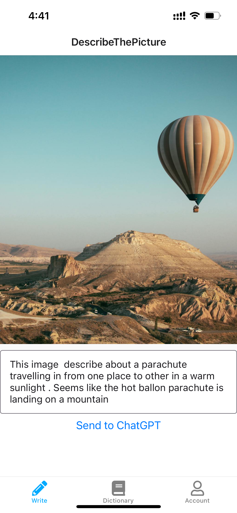
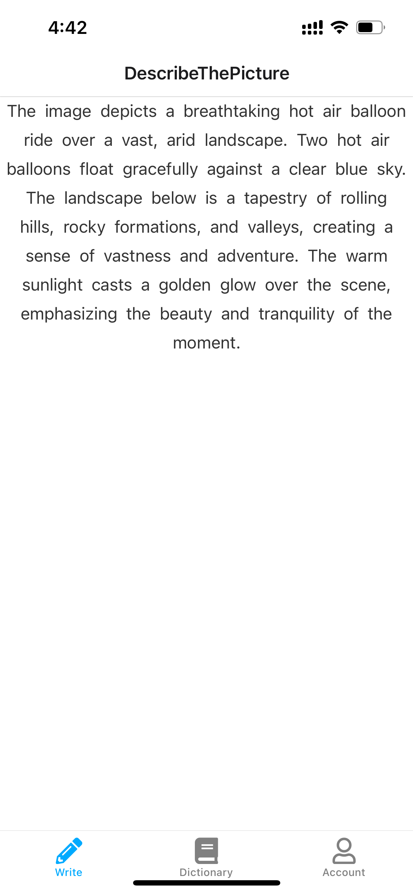
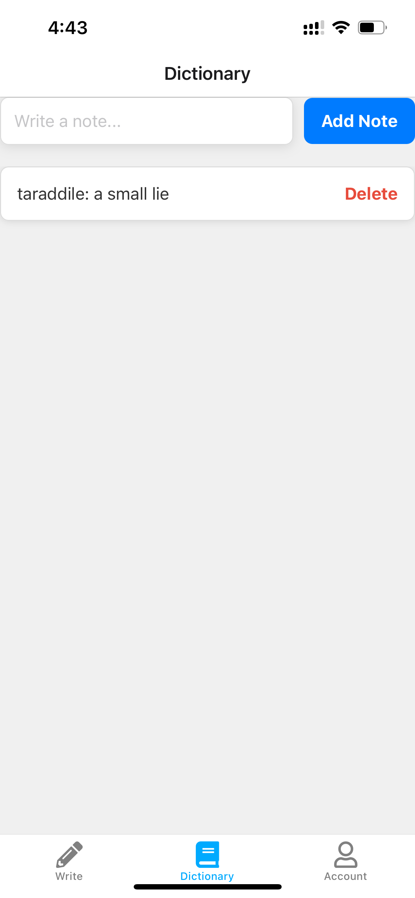
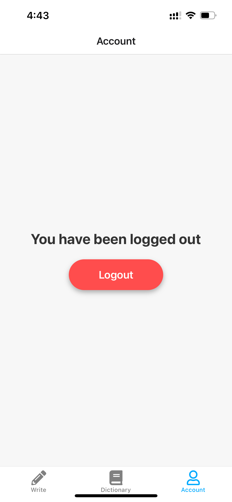

git clone https://github.com/SRB-Kautilya/Learn-English.git

npm install and npm start 

IDEA:

 English can be learned in many ways, one of the way is describing the picture  or writing about that picture in 50 words and correcting it with a professional Teacher.

 As AI is evolving, I taken chatgpt as the teacher so after you write 50 words , you can send the picture to AI and compare how AI returns it, based on it  you can learn english.

Idea in to Excution:

# 1) As usual  login Page  

# 2) After you login a random image will show up and text below it to write or describe about image. once you describe you can send the image to Ai by clicking on button. you can scroll horizontally to get a new image.

# 3) once you click on send to chatGpt, the response will show up on new page. you can read it, if any word unable to understand you can click on it, it will redirect you to google dictionary

# 4) Dictionary Tab where you can save and read every day 

# 5) Logout page which redirect to login page

